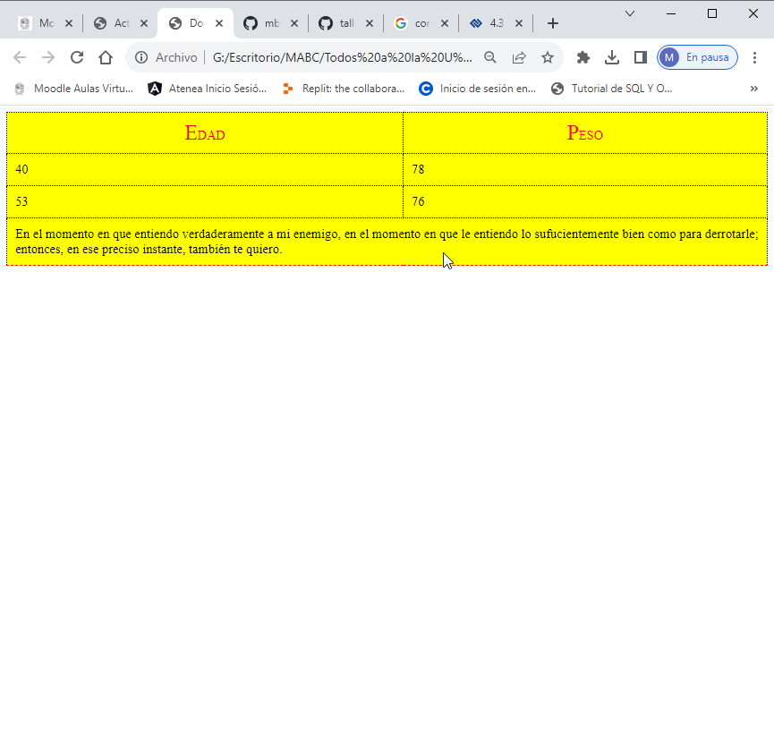

<h1>Taller 9 - Miguel Ángel Barbosa Cornelio</h1>

<h2>Información</h2>

Curso: Full Stack Básico - Grupo 1

Profesor: Cristian Patiño

<h2>Link de la página web</h2>

<h2>Punto 1: Link de Figma</h2>
<a href="https://www.figma.com/file/0JATDOtnDeIRTyiQSyaN3l/Miguel-%C3%81ngel-Barbosa-Cornelio?type=design&node-id=6%3A257&mode=design&t=IIVmgqVArrgUAjY6-1">Link de Figma</a>

<h2>Punto 2: Diseño HTML</h2>

<h2>Punto 3: Diseño CSS</h2>

<h2>Punto 4: Títulos</h2>

<h2>Punto 5: Párrafo</h2>

<h2>Punto 6: Links</h2>

<h2>Punto 7 y 8: Navegación</h2>

<h2>Punto 9: Tabla</h2>
